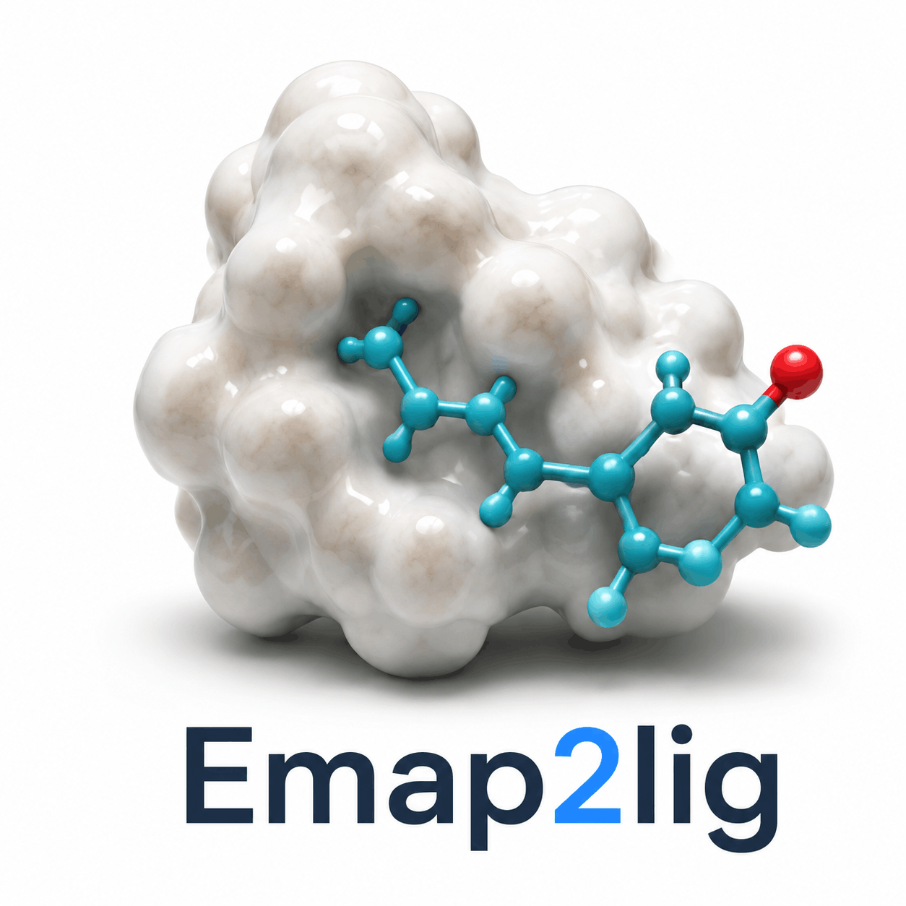
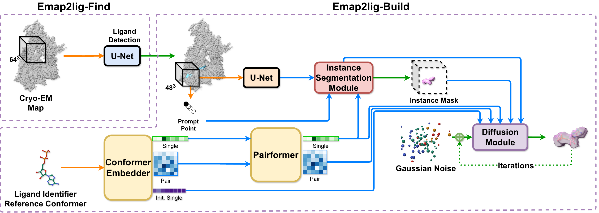

<p align="center">
  
</p>

[](https://kiharalab.org/)
[](https://em.kiharalab.org/algorithm/Emap2lig-Find)
[](https://em.kiharalab.org/algorithm/Emap2lig-Build)
[](https://huggingface.co/KiharaLab/Emap2lig)
<br/>
[](https://docs.python.org/3/)
[](https://developer.nvidia.com/cuda-toolkit)
[](https://developer.apple.com/metal/pytorch/)

Official Emap2lig inference pipeline for finding ligand density blobs and building atomic ligand structures in cryo-EM maps.

- Stage 1 (**Find**): segment ligand density blobs from cryo-EM maps.
- Stage 2 (**Build**): generate ligand atomic coordinates from blobs.

<div align="center">
  
</div>

> [!IMPORTANT]
> Local inference requires a supported accelerator: **Linux + NVIDIA CUDA** or
> **macOS + Apple MPS**. CPU inference is not supported.
>
> **No GPU?** Use the free [KiharaLab web server](https://em.kiharalab.org/algorithm/Emap2lig-Find) instead.

## Usage

| Path | GPU | Install |
|------|-----|---------|
| [KiharaLab Web Server](#kiharalab-web-server) | No | None |
| [Local](#local) — CLI, Web GUI, or Agent Skill | Linux/CUDA or macOS/MPS | See below |

### KiharaLab Web Server

No installation or GPU. Upload a map on **Find**, then run **Build** with your ligands.

| Stage | URL |
|-------|-----|
| **Find** | [em.kiharalab.org/algorithm/Emap2lig-Find](https://em.kiharalab.org/algorithm/Emap2lig-Find) |
| **Build** | [em.kiharalab.org/algorithm/Emap2lig-Build](https://em.kiharalab.org/algorithm/Emap2lig-Build) |

Details: [docs/web-server.md](docs/web-server.md)

### Local

#### Hardware requirements

- **Linux**: NVIDIA GPU with **8 GB+ VRAM**, Post-Ampere (RTX 30xx / 40xx / 50xx or newer), CUDA 12 / 13 compatible driver
- **macOS**: Apple Silicon or MPS-capable Mac with **macOS 13.2+** for local inference
- **Python**: 3.12 ([uv](https://docs.astral.sh/uv/) recommended)

Emap2lig selects the accelerator by platform: Linux uses CUDA, macOS uses MPS.
Other platforms and CPU-only inference are not supported locally.

Model weights **download automatically** from [HuggingFace](https://huggingface.co/KiharaLab/Emap2lig) on first run — no manual download step.

#### CLI

```bash
uv tool install --from git+https://github.com/kiharalab/Emap2lig emap2lig

emap2lig \
  --input-map examples/emd_30556.map.gz \
  --output-dir outputs_30556 \
  --ligand-list examples/emd_30556.yaml \
  --emdb-id 30556
```

Full flags and examples: [docs/cli.md](docs/cli.md) · Install options: [docs/installation.md](docs/installation.md)

#### Web GUI

Requires cloning the repo (includes pre-built frontend; no Node.js needed for normal use):

```bash
git clone https://github.com/kiharalab/Emap2lig.git
cd Emap2lig && uv sync --group web
uv run --group web python app/start.py
```

Open `http://localhost:40427`. Guide: [docs/web-gui.md](docs/web-gui.md)


#### Agent Skill

```bash
npx skills add kiharalab/Emap2lig --skill emap2lig
```

Then ask your agent: *"Run the Emap2lig pipeline on EMD-30556"*. Guide: [docs/agent-skill.md](docs/agent-skill.md)

## Documentation

| Topic | Guide |
|-------|--------|
| Installation | [docs/installation.md](docs/installation.md) |
| Supported platforms | [docs/platforms.md](docs/platforms.md) |
| CLI | [docs/cli.md](docs/cli.md) |
| Web GUI | [docs/web-gui.md](docs/web-gui.md) |
| KiharaLab web server | [docs/web-server.md](docs/web-server.md) |
| Agent Skill | [docs/agent-skill.md](docs/agent-skill.md) |
| Input formats | [docs/input-format.md](docs/input-format.md) |
| Output structure | [docs/output.md](docs/output.md) |
| Programmatic API | [docs/api.md](docs/api.md) |
| Fragment detection | [docs/fragment-detection.md](docs/fragment-detection.md) |
| Model weights | [docs/models.md](docs/models.md) |

## License

- The **source code** in this repository is released under the [GNU General Public License v3.0](LICENSE).
- The **trained model weights** are distributed under a separate license and are **free for academic and non-commercial research use only**.

Commercial use of the model weights is not permitted without permission.
For commercial licensing inquiries, please contact the authors.

See [WEIGHT_LICENSE.md](WEIGHT_LICENSE.md) for full terms.

Weights **download automatically** on first run; see [Model weights](docs/models.md).

## Latest Updates

- **2026-05-22: uv Tool Installation**
  - Emap2lig can now be installed globally via `uv tool install` — no cloning
    needed for CLI usage.
  - Added [Agent Skill](skills/emap2lig/) following the agentskills.io
    specification for AI-agent-guided usage.

- **2026-01-12: v0.3.1 Release**
  - Detection model update.
  - Per-blob ligand assignment in Web GUI.
  - Web GUI tutorial system.

- **2025-11-05: v0.3.0 Release**
  - Initial public release with CLI and Web GUI.
  - Two-stage pipeline: MUNet segmentation + PairFormer/AtomDiffusion modeling.

## Acknowledgements

Emap2lig builds upon and is inspired by several excellent open-source projects:

- **[Boltz](https://github.com/jwohlwend/boltz)** (Wohlwend et al.) — A
  diffusion-based biomolecular interaction modeling framework. Emap2lig's
  structure prediction approach is inspired by diffusion-based modeling
  techniques pioneered in the Boltz family of models.

- **[Mol\*](https://molstar.org/)** (Sehnal et al.) — An open-source
  molecular visualization library used for 3D rendering of cryo-EM maps and
  predicted ligand structures in the Emap2lig Web GUI.

- **[Hugging Face Hub](https://huggingface.co/KiharaLab/Emap2lig)** — Model
  weight and data distribution platform.

If you use Emap2lig in your research, please cite our work (see below) and
the relevant dependencies above.

## Citation

If you use Emap2lig in your research, please cite the following:

```bibtex
@article{li2026direct,
  title        = {Direct Detection and Atomic Modeling of Ligands in Cryo-EM Maps Using Deep Learning},
  author       = {Li, Shu and Jain, Anika and Kagaya, Yuki and Park, Joon Hong and Kihara, Daisuke},
  journal      = {bioRxiv},
  year         = {2026},
  doi          = {10.64898/2026.06.01.729423},
  url          = {https://www.biorxiv.org/content/10.64898/2026.06.01.729423v1},
  note         = {Preprint}
}
```
