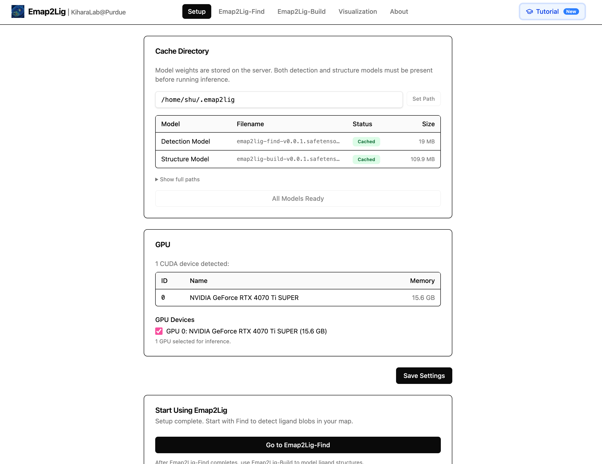
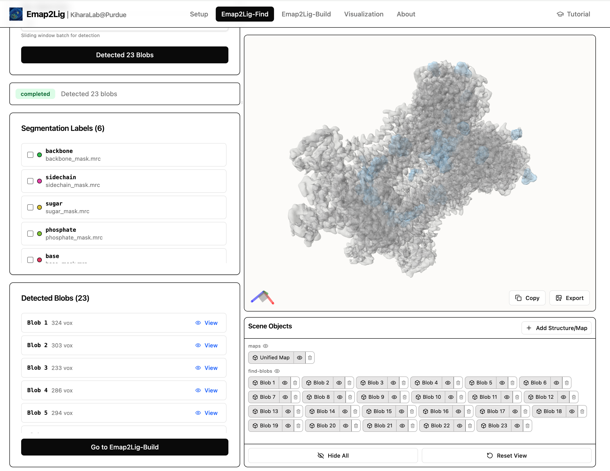
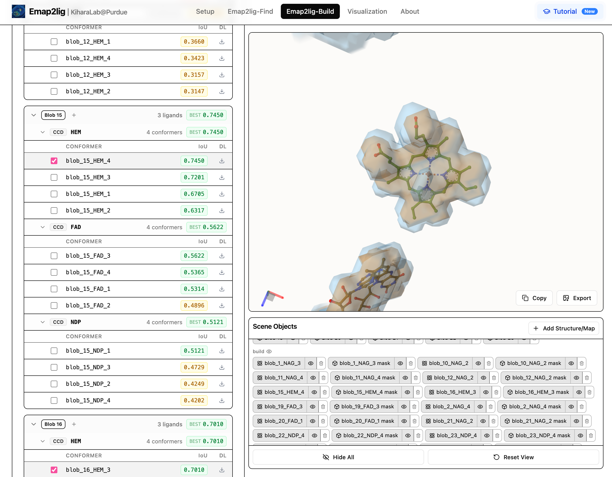

# Web GUI

Browser-based interface in `app/` with Mol* visualization. Find and Build are
separate tabs, matching the two-stage pipeline.

## Prerequisites

- Python **3.12** and [uv](https://docs.astral.sh/uv/)
- Supported local inference accelerator (same as CLI): Linux/CUDA or macOS/MPS
- Clone the repository — the GUI is **not** available via `uv tool install`

## Install and run

```bash
git clone https://github.com/kiharalab/Emap2lig.git
cd Emap2lig
uv sync --group web
uv run --group web python app/start.py
```

Open `http://localhost:40427` (default).

The repository includes a pre-built `app/frontend/dist/`. **Node.js and npm are
not required** for normal use.

### Options

```bash
# Custom port
uv run --group web python app/start.py --port 8080

# Headless (no browser auto-open)
uv run --group web python app/start.py --no-browser
```

| Option | Description |
|--------|-------------|
| `--port INT` | Port (default: `40427`) |
| `--no-browser` | Do not open a browser tab |
| `--rebuild` | Rebuild frontend from source (requires Node.js and npm) |

## Workflow

- **Setup** — model cache path, download weights, accelerator selection
- **Find** — input map, detection options, inspect blobs in Mol*
- **Build** — ligands (global or per-blob), run modeling, view conformers
- **Visualization** — load an existing output directory

Input formats match the CLI: [Input formats](input-format.md).

## Interactive tutorial

Click **Tutorial** in the top-right corner of the header to start a guided
walkthrough of the full Emap2lig workflow (Setup → Find → Build →
Visualization). The tutorial loads pre-computed example results, so an
accelerator is not required to follow along.



On first visit, the button is highlighted with a **New** badge. You can restart
the tutorial anytime from the same button.

### Find and Build tabs

The walkthrough covers **Emap2lig-Find** (ligand blob detection with Mol*
visualization) and **Emap2lig-Build** (per-blob ligand assignment, structure
modeling, and ranked conformers).





## Architecture

For API routes and component layout, see
[`skills/emap2lig/references/GUI.md`](../skills/emap2lig/references/GUI.md).
